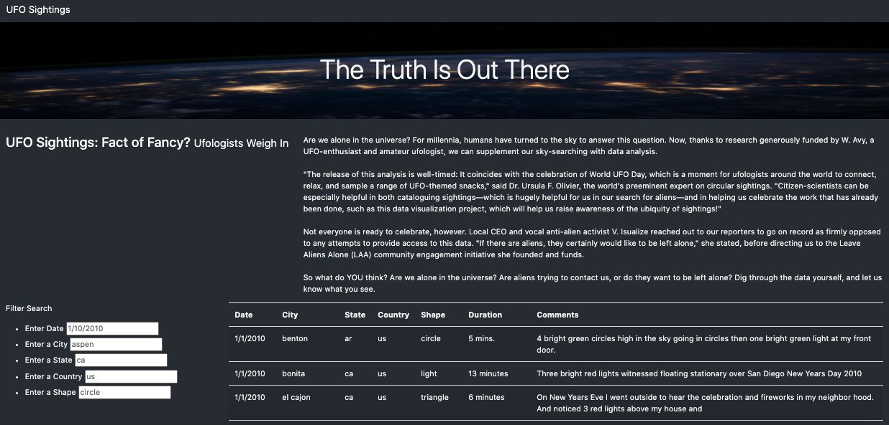
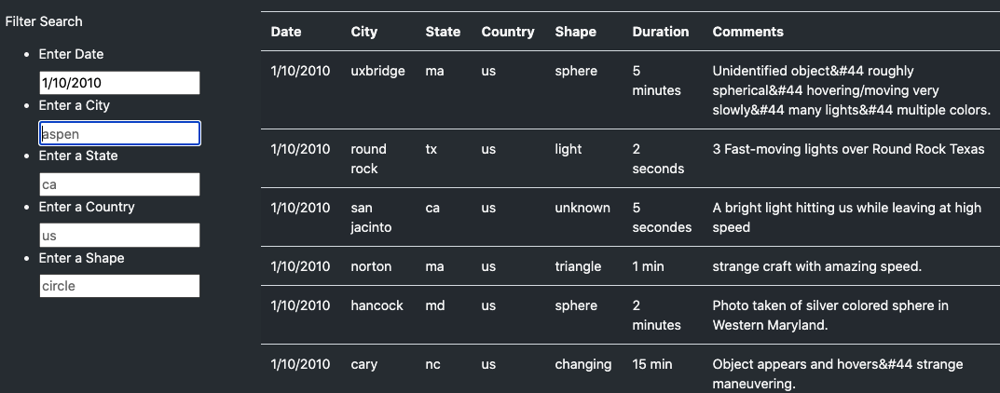
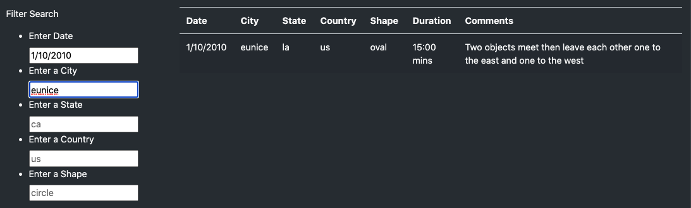

# UFO

Overview of Project

Dana’s webpage and dynamic table are working as intended, but she’d like to provide a more in-depth analysis of UFO sightings by allowing users to filter for multiple criteria at the same time. In addition to the date, you’ll add table filters for the city, state, country, and shape.

Results: Describe to Dana how someone might use the new webpage by walking her through the process of using the search criteria. Use images of your webpage during the filtering process to support your explanation.

The search criteria will show results for exact filters that you input. You can filter through date, city, state, country, or shape. 

If no results appear, that means nothing matches your search. If you input more than one filter, they must match all the search criteria exacly to get results such as the example below.

    
Summary: In a summary statement, describe one drawback of this new design and two recommendations for further development.

One drawback of this new design is that you cannot compile resultsof different filters. For example, if I wanted to see all results for a specific date as well as a specific city, I could only see results that matched both at the same time. To improve this, we could add a filtering option that allows you to save and continue to add search results. Another development that would improve this design is the ability to search for multiple dates, cities, states, countries, or shapes at one time. For example, if I wanted to see results for the cities of anchorage and el cajon I could search for more than one in a single search.